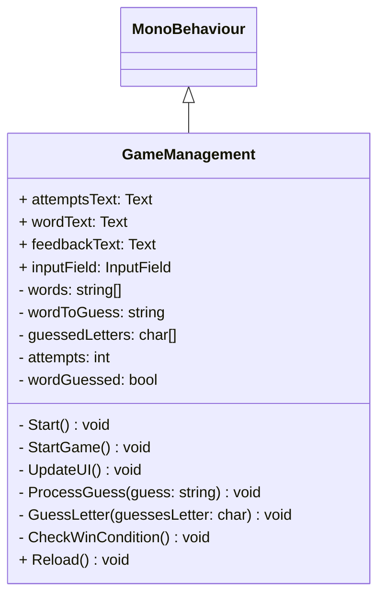

# 03-Hangman-IEbner

```mermaid
classDiagram
    MonoBehaviour <|-- GameManagement

    class GameManagement{
        + attemptsText: Text
        + wordText: Text
        + feedbackText: Text
        + inputField: InputField 

        - words: string[]
        - wordToGuess: string
        - guessedLetters: char[]
        - attempts: int 
        - wordGuessed: bool

        - Start() void
        - StartGame() void
        - UpdateUI() void
        - ProcessGuess(guess: string) void
        - GuessLetter(guessesLetter: char) void
        - CheckWinCondition() void
        + Reload() void

    }
```
