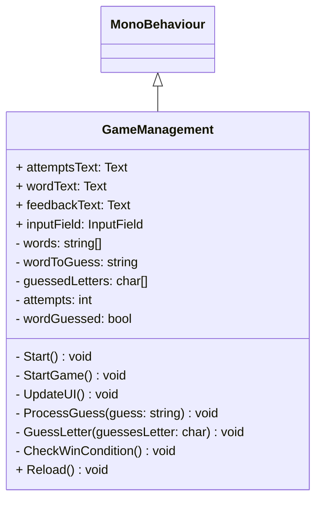

# 03-Hangman-IEbner
Hangman is a simple game where you have to guess a word related to coding. If you use all of your six attempts, you automatically lose and need to restart. If you guess the word within those attempts you win.

**Dev Platform**: Windows 11, Unity 2022.3.9f1, Visual Studio 2019

**Leasons Learned**: Coding mit ChatGPT, Klassendiagramme Wiederholung

